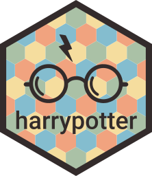

# harrypotter 


[](https://cran.r-project.org/package=harrypotter)
[](https://github.com/metacran/cranlogs.app)
[](https://github.com/metacran/cranlogs.app)

This package provides the first round of palettes derived from the *Harry Potter* film series.

At its first version, it simply contains the palettes of the [Hogwarts](https://en.wikipedia.org/wiki/Hogwarts) Houses. They have been chosen manually, taking into account its consistency with all the existing branding of the franchise, but its suitability for data visualisation. 

> Most of us need to _listen_ to the music to understand how beautiful it is. But often that’s how statistics are presented: we show the notes instead of playing the music.

The colour palette should be beautiful, useful for plotting data and shoulr relate to desired style; in this case, should relate to the Harry Potter world. Some of the colours might change in future versions, in order to find this balance between suitability for plotting and relatable to the Harry Potter universe.

<center></center>


Installation
-------------

Just copy and execute this bunch of code and you'll have the last version of the package installed:


```r
install.packages("harrypotter")
```

And you can now use it:


```r
library(harrypotter)
```

Usage
-----

The default colour scale of the package is the one named **Always**. If you prefer to choose another one, you'll need to specify which house you want the palette from.

You can get started using base R plot functions, and the `hp()` function. Its first argument `n` lets you set the number of colours to be mapped. This way you can set different resolutions. Let's say that you want a palette made from the house **Gryffindor**, then just type `option = "Gryffindor"`. 


```r
pal <- hp(n = 8, house = "Gryffindor")
image(volcano, col = pal)

pal <- hp(n = 128, house = "Gryffindor")
image(volcano, col = pal)
```

<center></center>

## ggplot2

Of course, this package has specific functions to behave seamlessly with the best data visiualisation library available. 
The package contains colour scale functions for **ggplot2** plots: `scale_colour_hp()` and `scale_fill_hp()`. 


Here is a made up example using the colours from the house of **Hufflepuff**,


```r
library(ggplot2)
ggplot(data.frame(x = rnorm(1e4), y = rnorm(1e4)), aes(x = x, y = y)) +
  geom_hex() + 
	coord_fixed() +
  scale_fill_hp(house = "hufflepuff") + 
	theme_bw()
```

<center></center>


or more made-up heatmaps:

<center></center>


Using the same function we can also plot these cloropleth maps of U.S. unemployment:

<center></center>

<center></center>


### Discrete Scales

But what if you want discrete scales? These functions also can be used for discrete scales with the argument `discrete = TRUE`. This argument, when TRUE, sets a finite number of sufficiently spaced colours within the selected palette to plot your data.


```r
ggplot(diamonds, aes(factor(color), fill=factor(cut))) +
	geom_bar(colour = "black") +
	scale_fill_hp(discrete = TRUE, option = "ronweasley2", name = "Cut") +
	ylab("") +
	xlab("Colour") +
	coord_flip()
```

<center></center>

You can also use discrete scales by adding `_d()` at the end of it instead, like `scale_fill_hp_d()`.


```r
dsamp <- diamonds[sample(nrow(diamonds), 1000), ]
ggplot(dsamp, aes(carat, price)) +
	geom_point(aes(colour = clarity)) +
	scale_colour_hp_d(option = "LunaLovegood", name = "Clarity") +
	xlab("Carat") +
	ylab("Price")
```

<center></center>


Don't forget to try them all.

<center></center>


# Palettes

```r
option = "Mischief"
```
<center></center>

---

```r
option = "Always"
```

<center></center>

---

```r
option = "Sprout"
```

<center></center>

---

```r
option = "LunaLovegood"
```

<center></center>

---

```r
option = "HermioneGranger"
```

<center></center>

---

```r
option = "HarryPotter"
```

<center></center>

---

```r
option = "DracoMalfoy"
```

<center></center>

---

```r
option = "RonWeasley"
```

<center></center>

---

```r
option = "NewtScamander"
```

<center></center>

---

```r
option = "Ravenclaw"
```

<center></center>

# Acknowledgments

* Special thanks to my buddy [Alfredo](aldomann.com) for designing the logo.