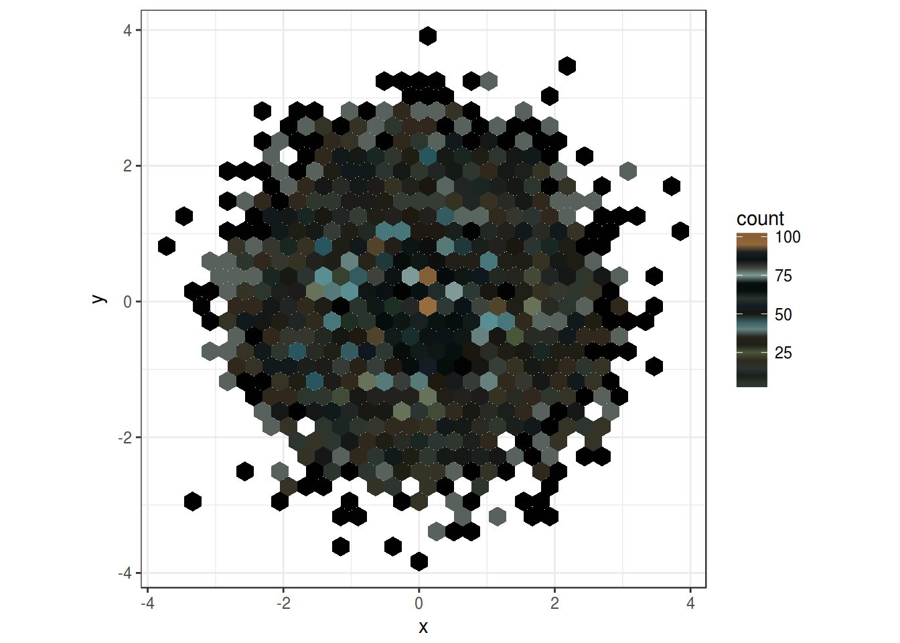
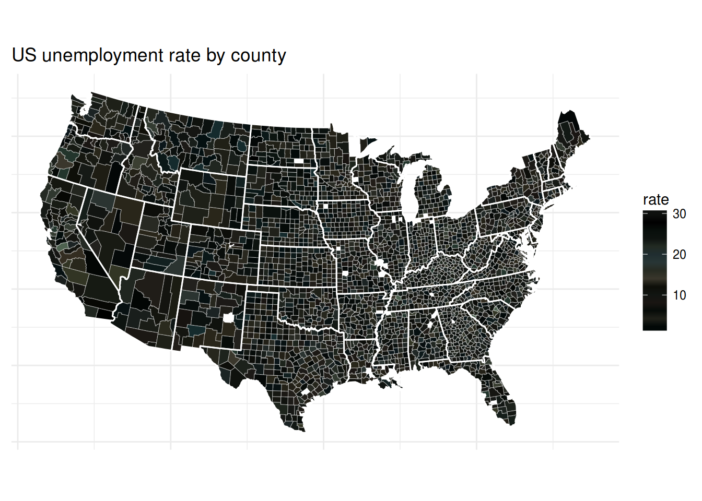

### Short Description

Use the color scales in this package to make plots that make use of the palette extracted from the *Harry Potter* movie franchise.

Install **harrypotter** from this repository:

``` r
library(devtools)
devtools::install_github("aljrico/harrypotter", force = TRUE)
library(harrypotter)
```

For base plots, use the `hp()` function to generate a palette:

``` r
x <- y <- seq(-8*pi, 8*pi, len = 40)
r <- sqrt(outer(x^2, y^2, "+"))
filled.contour(cos(r^2)*exp(-r/(2*pi)), 
               axes=FALSE,
               color.palette=hp,
               asp=1)
```


For ggplot, use `scale_colour_hp()` and `scale_fill_hp()`:

``` r
library(ggplot2)
ggplot(data.frame(x = rnorm(10000), y = rnorm(10000)), aes(x = x, y = y)) +
  geom_hex() + coord_fixed() +
  scale_fill_hp(movie = 3) + theme_bw()
```



Introduction
============

The [**harrypotter**](http:://github.com/aljrico/harrypotter) package brings to R colour scales created by [Alejandro Jimenez Rico](https://github.com/aljrico) from the [**Harry Potter** film series](https://en.wikipedia.org/wiki/Harry_Potter_(film_series))

The Colour Scales
=================

The package contains eight color scales: One for each movie of the franchise.


Usage
=====

The `hp()` function produces the Harry Potter color scale. You can choose the other color scale options using the `movie` parameter.

The package also contains color scale functions for **ggplot** plots: `scale_color_hp()` and `scale_fill_hp()`. As with `hp()`, you can use the other scales with the `movie` argument in the `ggplot` scales. Here the scale from the 7th is used for a cloropleth map of U.S. unemployment:

``` r
unemp <- read.csv("http://datasets.flowingdata.com/unemployment09.csv",
                  header = FALSE, stringsAsFactors = FALSE)
names(unemp) <- c("id", "state_fips", "county_fips", "name", "year",
                  "?", "?", "?", "rate")
unemp$county <- tolower(gsub(" County, [A-Z]{2}", "", unemp$name))
unemp$county <- gsub("^(.*) parish, ..$","\\1", unemp$county)
unemp$state <- gsub("^.*([A-Z]{2}).*$", "\\1", unemp$name)

county_df <- map_data("county", projection = "albers", parameters = c(39, 45))

names(county_df) <- c("long", "lat", "group", "order", "state_name", "county")
county_df$state <- state.abb[match(county_df$state_name, tolower(state.name))]
county_df$state_name <- NULL

state_df <- map_data("state", projection = "albers", parameters = c(39, 45))

choropleth <- merge(county_df, unemp, by = c("state", "county"))
choropleth <- choropleth[order(choropleth$order), ]

ggplot(choropleth, aes(long, lat, group = group)) +
  geom_polygon(aes(fill = rate), colour = alpha("white", 1 / 2), size = 0.2) +
  geom_polygon(data = state_df, colour = "white", fill = NA) +
  coord_fixed() +
  theme_minimal() +
  ggtitle("US unemployment rate by county") +
  theme(axis.line = element_blank(), axis.text = element_blank(),
        axis.ticks = element_blank(), axis.title = element_blank()) +
  scale_fill_hp(movie=7)
```



The ggplot functions also can be used for discrete scales with the argument `discrete=TRUE`.

``` r
p <- ggplot(mtcars, aes(wt, mpg))
p + geom_point(size=4, aes(colour = factor(carb))) +
    scale_color_hp(discrete=TRUE, movie = 1) +
    theme_bw()
```


